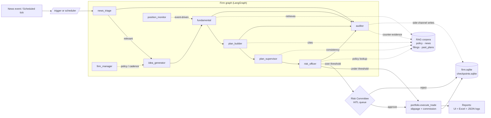
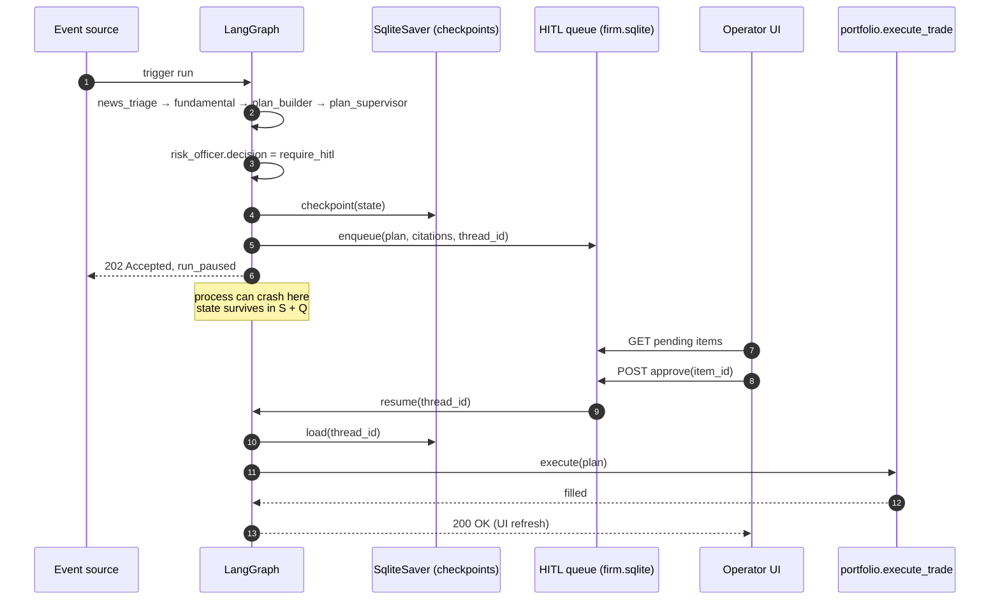
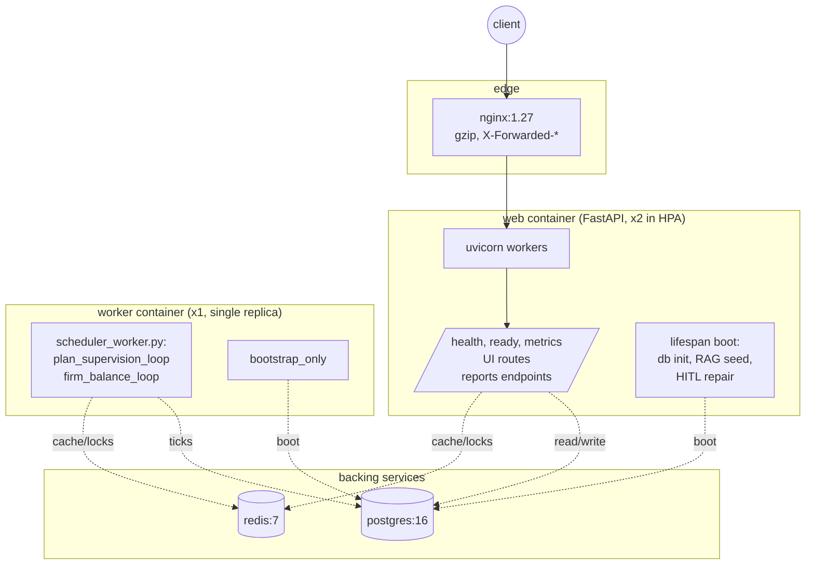
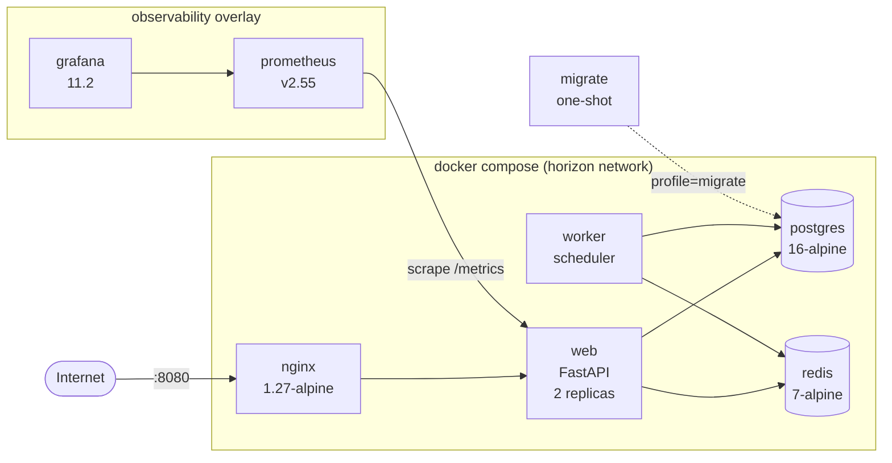
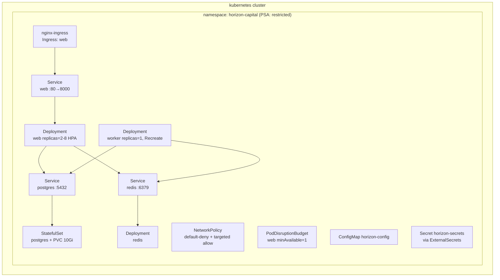
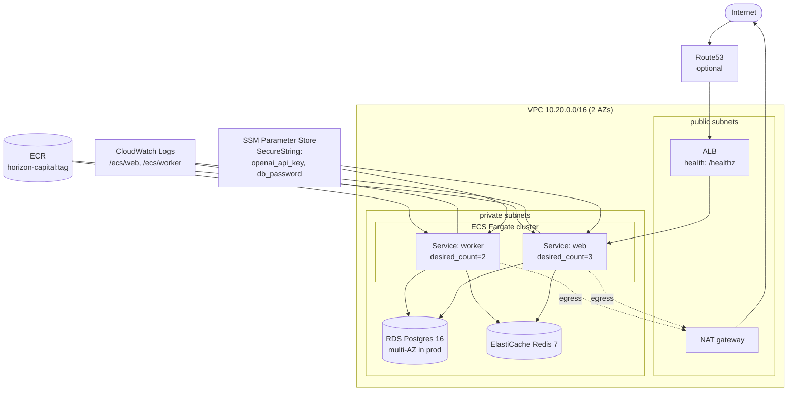
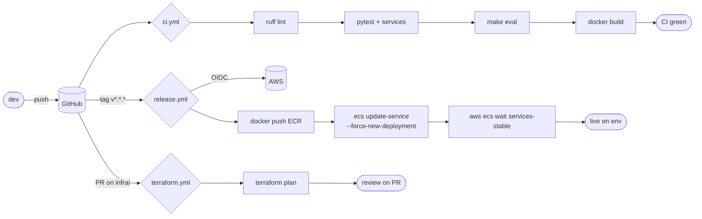
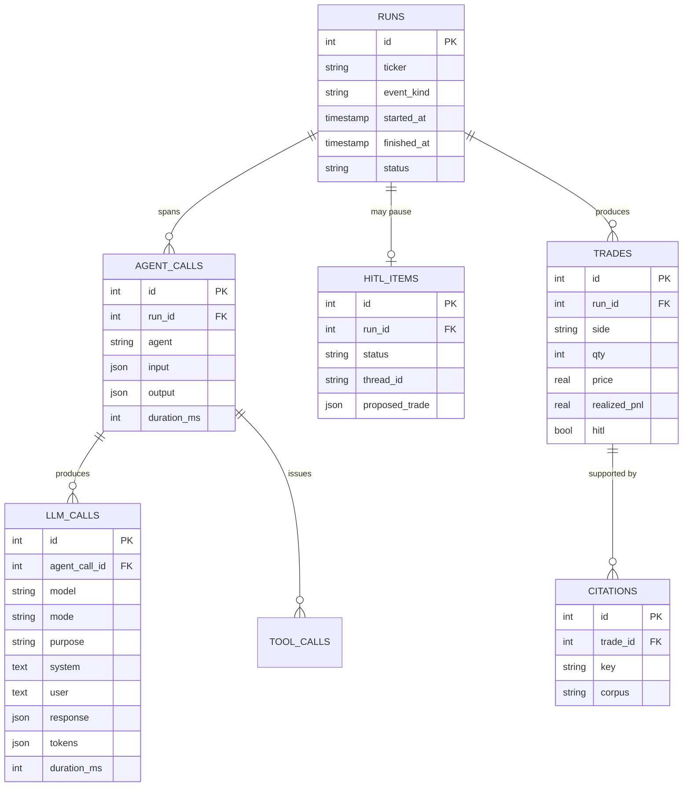

# Architecture diagrams

Mermaid sources for the diagrams the brief asks for: **logical view**
(agents, orchestration, RAG, state, HITL, observability) and
**deployment view** (where everything lives in dev, K8s, AWS).

If your reader doesn't have a Mermaid-aware viewer (most IDEs and
GitHub do), the PNG/SVG pair at the repo root is the canonical static
copy.

---

## 1. Logical view — agent pipeline



---

## 2. State flow during a HITL pause



---

## 3. Process model — what runs where



---

## 4. Container topology (Docker Compose)



---

## 5. Deployment view — Kubernetes (Kustomize)



---

## 6. Deployment view — AWS (Terraform)



---

## 7. CI/CD pipeline



---

## 8. Trace data model



---

## 9. Configuration & secrets flow

```mermaid
flowchart LR
    subgraph sources["sources, by precedence"]
        env[OS env]
        envfile[.env file]
        secrets["/run/secrets/* (Docker secrets)"]
        defaults[Settings defaults]
    end

    sources --> SET[app/core/settings.py<br/>Pydantic Settings]
    SET --> SHIM[app/config.py<br/>back-compat shim]
    SET --> APP[App code:<br/>get_settings()]

    subgraph cloudSecrets["cloud secret stores"]
        SSM[AWS SSM<br/>SecureString]
        K8sExt[ExternalSecrets<br/>Vault / AWS SM]
    end

    SSM -. mounts as env .-> env
    K8sExt -. mounts as /run/secrets/* .-> secrets
```

---

## How these diagrams are used

* **README** points readers here.
* **demo-script.md** says to open §1 (the agent pipeline) during the
  architecture intro.
* **walkthrough-one-trade.md** is the narration for §1 + §2.
* The repo root carries the static `architecture.{dot,svg,png}` (logical),
  `architecture_simple.{dot,svg,png}` (plain English) and
  `architecture_deployment.{dot,svg,png}` (deployment view) as fallbacks
  for viewers that don't render Mermaid.
