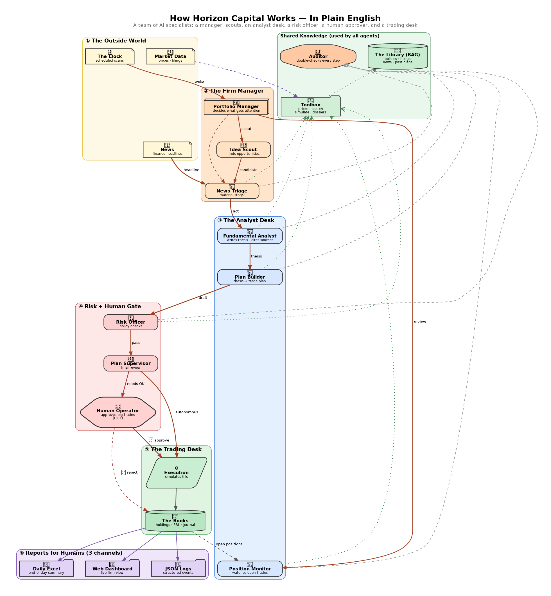

# How Horizon Capital Works — In Plain English

> A 3-minute, no-jargon tour of the firm for non-technical readers.
> If you only look at one picture, look at **`architecture_simple.png`** at the repo root.

## The mental model

Think of Horizon Capital as a small **AI investment firm** with seven kinds of workers, plus
a human operator and a "library" of reference material. Each box on the diagram is one role.

| # | Worker(s) | Job in one sentence |
|---|-----------|---------------------|
| ① | **Outside World** — News, Market Data, Clock | Feeds events into the firm: news headlines, live prices, scheduled wake-ups. |
| ② | **Portfolio Manager**, **News Triage**, **Idea Scout** | The manager decides what gets attention; triage filters incoming news; the scout proactively looks for opportunities. |
| ③ | **Fundamental Analyst**, **Plan Builder**, **Position Monitor** | The analyst writes the investment thesis (with citations). The plan builder turns the thesis into a concrete trade plan. The monitor watches open positions. |
| ④ | **Risk Officer**, **Plan Supervisor**, **Human Operator** | The risk officer checks every plan against policy. The supervisor does a final review. The human operator (HITL = Human-In-The-Loop) approves anything material. |
| ⑤ | **Execution**, **The Books** | Execution simulates the fill (paper trading only). The books are the ledger of holdings, P&L, journal, trades. |
| ⑥ | **Reports** — Daily Excel, Web Dashboard, JSON Logs | How humans see what happened: three channels, every event. |
| 🔍 | **Auditor** (side channel) | A separate critic that double-checks every other agent's output. |
| 📚 | **The Library (RAG)** and **The Toolbox** | Shared knowledge every agent can search: policies, past plans, news, filings — plus tools like `simulate_order`, `get_quote`, `build_dossier`. |

## How a trade actually happens — step by step

1. **A news headline arrives** (or the clock fires, or the scout finds something).
2. **News Triage** scores it for materiality — is this worth acting on?
3. If yes, the **Fundamental Analyst** writes a thesis: durability, margins, valuation, citations from filings and past plans.
4. The **Plan Builder** turns the thesis into a draft plan: ticker, side, quantity, target price, stop, citations.
5. The **Risk Officer** checks the plan against policy (position size, concentration, simulate_order feasibility).
6. The **Plan Supervisor** decides: autonomous (small, low-risk) or HITL (anything material).
7. If HITL: a brief is prepared and the **Human Operator** approves or rejects in the web UI.
8. **Execution** simulates the fill; **The Books** records it.
9. Every step is logged to **traces**, reviewed by the **Auditor**, and surfaced in the daily Excel report, the web dashboard, and the JSON log stream.

## Why three roles between "thesis" and "trade"?

Because the failure modes of a real fund don't come from "no idea" — they come from
acting on a bad idea, an oversized position, or skipping a policy check. Each of the three
gates (Risk Officer → Plan Supervisor → Human Operator) has a different job:

- **Risk Officer** is rule-based and quantitative — it runs `simulate_order` and checks every policy box.
- **Plan Supervisor** is judgement-based — does this plan make sense in the firm's posture today?
- **Human Operator** is the final, non-bypassable human check on material decisions.

## What "RAG" means here

RAG = Retrieval-Augmented Generation. In plain English: before any LLM writes a thesis,
the system **searches the firm's library** for relevant passages — policies, filings,
news, past plans — and forces the LLM to **cite** them. No citation, no plan.

## Deployment view (for operators)

If you also want to know how the boxes map to actual containers and cloud resources,
see **`architecture_deployment.png`** at the repo root and `docs/technical-overview.md`.

## See also

- `architecture.png` — full logical architecture (more detail)
- `architecture_simple.png` — this simple view
- `architecture_deployment.png` — containers + cloud
- `docs/walkthrough-one-trade.md` — annotated trace of one real trade
- `docs/demo-script.md` — 10-minute live demo script
